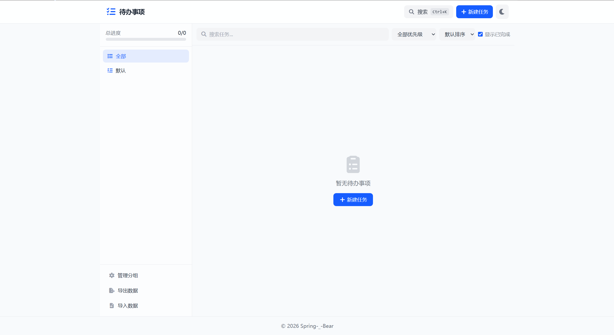

[TOC]

# 待办事项

一个功能丰富的待办事项管理工具，基于 `HTML + Tailwind CSS + JavaScript` 开发，支持任务分组、周期性任务、拖动排序、优先级管理、暗黑模式等功能，适配移动端与桌面端。所有数据存储在浏览器 `localStorage` 中，无需后端服务器，保护用户隐私。

在线访问：[https://static.springbear.cn/todo-list/](https://static.springbear.cn/todo-list/)

## 功能特点
- 📁 任务分组：支持自定义分组，每个分组独立进度条，侧边栏/顶部标签切换
- 🔄 周期性任务：支持每日、每周、每月、工作日、周末五种重复类型，完成后自动延续
- ↔️ 拖动排序：支持桌面端鼠标拖拽和移动端长按拖拽，直观调整任务顺序
- 📱 响应式布局：桌面端侧边栏布局，移动端顶部标签切换，完美适配各种设备
- 🌙 暗黑模式：支持亮色/暗色主题切换，自动记忆用户偏好，适配系统主题
- 🔴 三级优先级：高/中/低优先级，带颜色标识和排序功能
- 📅 截止日期：日期选择器，逾期任务红色高亮提示
- 🔍 智能搜索：支持任务标题/描述/备注模糊搜索，快捷键 `Ctrl+K` 快速唤起
- 📊 进度可视化：总进度和分组进度实时展示，进度条直观反馈
- ✅ 完成标记：一键标记完成/撤销，支持显示/隐藏已完成任务
- 💾 数据导入导出：支持 `JSON` 格式数据备份与恢复
- 🔒 隐私保护：所有数据仅存储在浏览器本地，不上传任何服务器
- ⌨️ 键盘快捷键：`Ctrl+K` 搜索、`Ctrl+N` 新建任务、`Esc` 关闭弹窗
- 🎨 交互动效：卡片悬浮、拖拽反馈、模态框动画、操作提示

## 使用方法
1. 直接打开 `HTML` 文件即可使用（无需部署，纯前端运行）
2. 分组管理：
   - 桌面端：点击左侧边栏分组切换任务列表
   - 移动端：点击顶部标签切换分组
   - 点击侧边栏「管理分组」按钮添加/编辑/删除分组
3. 任务操作：
   - 点击「新建任务」或使用快捷键 `Ctrl+N` 打开任务表单
   - 填写标题、描述、分组、优先级、截止日期、重复类型等信息
   - 点击任务卡片左侧圆圈标记完成/撤销
   - 点击编辑按钮（铅笔图标）修改任务
4. 拖动排序：
   - 桌面端：拖拽任务卡片右侧的拖拽手柄（六点图标）调整顺序
   - 移动端：长按拖拽手柄约 0.3 秒后开始拖拽
5. 搜索任务：
   - 使用页面顶部搜索框输入关键词筛选任务
   - 或使用快捷键 `Ctrl+K` 打开全局搜索，跨分组搜索任务
6. 数据管理：
   - 点击「导出数据」下载 JSON 备份文件
   - 点击「导入数据」选择之前导出的 JSON 文件恢复数据
7. 周期任务：
   - 创建任务时选择重复类型（每日/每周/每月/工作日/周末）
   - 完成后任务自动延续到下一个日期，无需手动创建

## 注意事项
- 数据存储完全依赖浏览器 `localStorage`，无服务器交互，所有数据仅保存在当前设备本地
- 清空浏览器缓存/切换浏览器/使用隐私模式均会导致数据丢失，建议定期导出备份
- 不同设备之间的数据不会自动同步，可通过导出/导入功能手动迁移
- 使用时需联网以加载 `Tailwind CSS` 和 `Font Awesome` 外部资源，首次加载后浏览器缓存可支持离线使用
- 拖动排序功能在移动端需长按拖拽手柄触发，避免与页面滚动冲突
- 快捷键 `Ctrl+K` 和 `Ctrl+N` 在部分浏览器/系统中可能被占用
- 暗黑模式适配基于 `Tailwind CSS` 的 `class` 策略，部分老旧浏览器可能显示异常
- 导入数据会覆盖当前所有数据，操作前请确认

## 成品展示

